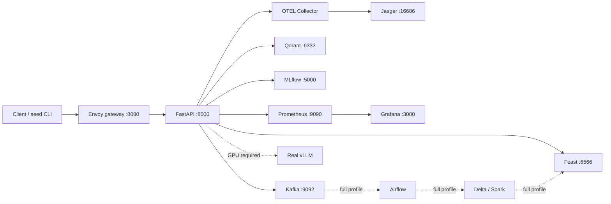

# Basic-path architecture and ownership

This diagram documents the individual, basic-system, no-GPU execution path.
Solid nodes ran locally; dashed nodes are intentionally outside this path.

| Responsibility | Individual owner | Evidence/status in this run |
|---|---|---|
| IP01–IP02 ingestion/orchestration | Student | Kafka topics and gateway ingestion verified; Airflow is not run. |
| IP03–IP04 data/ML | Student | Delta/airflow materialization not run; Feast contract and health verified. |
| IP05–IP07 serving/retrieval | Student | Qdrant indexed/searchable; MLflow champion exists; vLLM `UNVERIFIED`. |
| IP08–IP10 platform/observability | Student | Gateway, Prometheus, Grafana, Jaeger, and OTEL are running; full-stack rate-limit and trace evidence is not claimed. |
| Presentation/incident narrative | Student | Use `docs/basic-run-report.md` and `ANSWERS.md` for the scoped demo. |

The boundaries that are not run are deliberately shown as such. They are not
substituted with mocks or inferred from a successful process exit.
